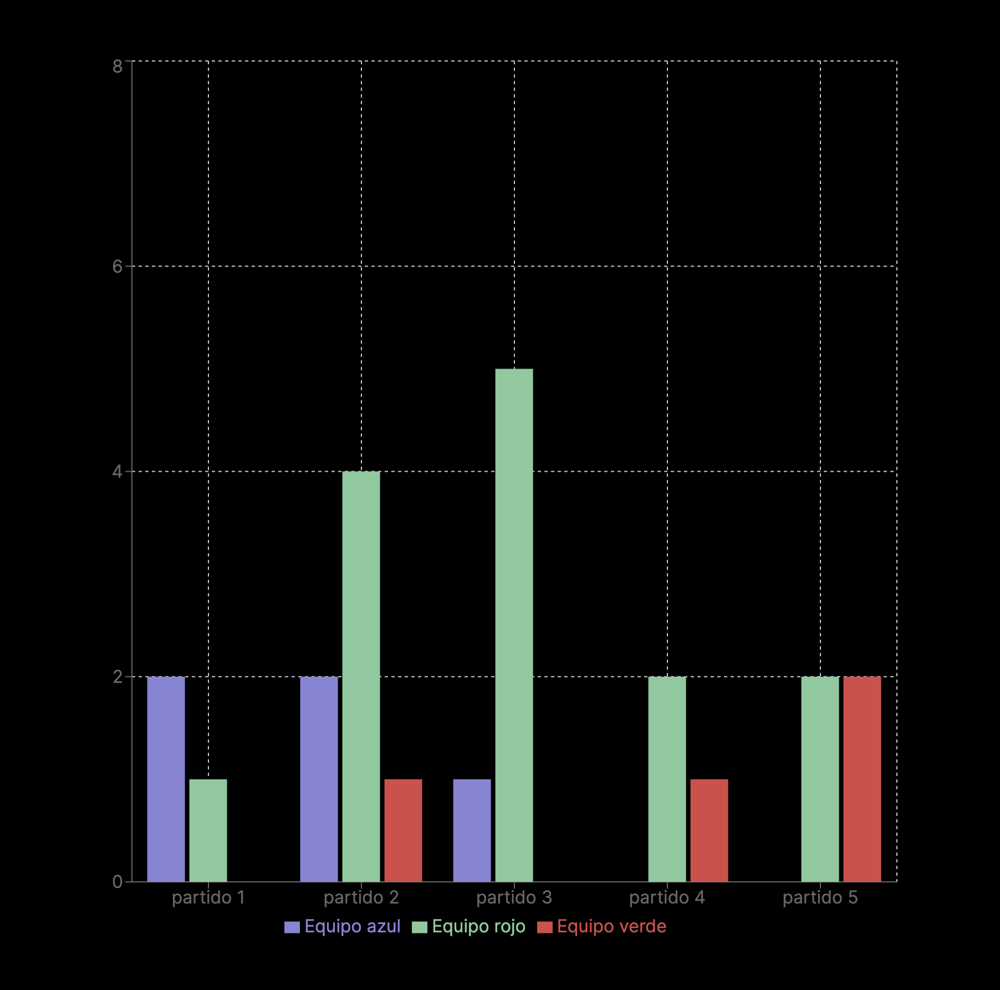

# Workshop: Developing a football season analysis website using google sheets and firebase hosting

This is a workshop to develop some functionalities and technologies like:

- NextJS
- Server components
- Data analysis
- Data representation
- Google Sheets

## What is inside?

In this monorepo you can find two apps

📖 Workshop documentation [Link](https://fife-docs.vercel.app/)


🚀 Workshop final project [Link](https://fife-fife-front.vercel.app/)



### Preparation

To install dependencies just run

```
pnpm install
```

To use the app make sure you have the correct variables, follow this example for more information: https://fife-docs.vercel.app/google-intro/spreadsheet-api

### Build

To build all apps and packages, run the following command:

```
pnpm build
```

### Develop

To develop all apps and packages, run the following command:

```
pnpm dev
```

### Remote Caching

Turborepo can use a technique known as [Remote Caching](https://turbo.build/repo/docs/core-concepts/remote-caching) to share cache artifacts across machines, enabling you to share build caches with your team and CI/CD pipelines.

By default, Turborepo will cache locally. To enable Remote Caching you will need an account with Vercel. If you don't have an account you can [create one](https://vercel.com/signup), then enter the following commands:

```
cd my-turborepo
npx turbo login
```

This will authenticate the Turborepo CLI with your [Vercel account](https://vercel.com/docs/concepts/personal-accounts/overview).

Next, you can link your Turborepo to your Remote Cache by running the following command from the root of your Turborepo:

```
npx turbo link
```

## Useful Links

Learn more about the power of Turborepo:

- [Tasks](https://turbo.build/repo/docs/core-concepts/monorepos/running-tasks)
- [Caching](https://turbo.build/repo/docs/core-concepts/caching)
- [Remote Caching](https://turbo.build/repo/docs/core-concepts/remote-caching)
- [Filtering](https://turbo.build/repo/docs/core-concepts/monorepos/filtering)
- [Configuration Options](https://turbo.build/repo/docs/reference/configuration)
- [CLI Usage](https://turbo.build/repo/docs/reference/command-line-reference)
