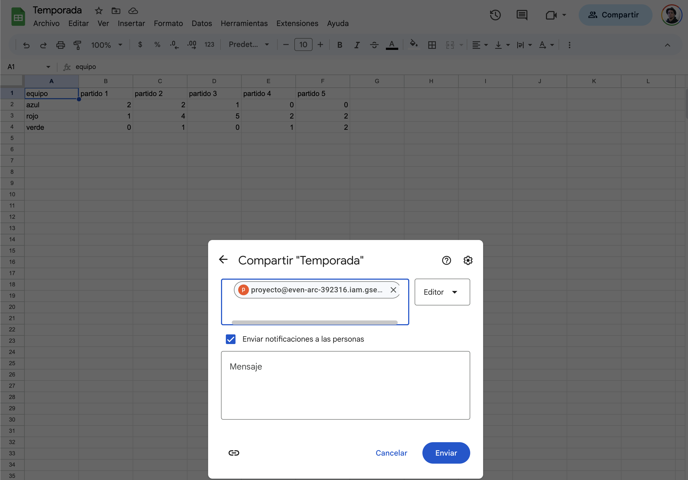

# Creemos los datos de acceso para usar Google Sheets como API

- Ingresa a [Google APIs Console](https://console.developers.google.com) con tu cuenta de google
- Crea un nuevo proyecto y dale un nombre
  - Aca pusimos la opcion `My Project 71943` y `Sin organizacion`
- Dale click al boton de `HABILITAR APIS Y SERVICIOS`
  - Si no lo encuentras ve directo al buscador de la pagina web, escribe `Google Sheets Api` dale click a la opcion con el mismo nombre
  - Si no funciona lo anterior ve directo a este link https://console.cloud.google.com/marketplace/product/google/sheets.googleapis.com
- Una vez en la pagina de Google Sheet API dale click al boton de `HABILITAR`
- Cuando termine de cargar la activacion seras redireccionado a la pagina de administracion, ahi dale click al boton de `CREA CREDENCIALES`
  - Si no encuentras esta opcion fijate en el panel izquierdo y dale a la opcion que dice `Credenciales`
- En la pagina de credenciales dale click a la opcion que dice `CREAR CREDENCIALES`
- Apareceran 4 opciones, denle click a la opcion 3 que dice `cuenta de servicio`
- Para este ejemplo llenamos el formulario de la siguiente forma:
  - `proyecto`, `proyecto`, `proyecto para la gdg barranquilla`
  - Luego le dimos a las opciones `continuar`, `continuar` y `listo`
- Una vez de nuevo en la pagina de credenciales, ir a la opcion nueva creada en la parte de cuentas de servicio
- En la pagina a la que fuimos direccionados darle click al tab que dice claves
- Una vez en esa pagina creemos una nueva clave JSON usando la opcion `AGREGAR CLAVE`
- Asegurate de guardar ese archivo que se genero
- El archivo deberia tener la siguiente estructura
  ```json
  {
    "type": "***",
    "project_id": "***",
    "private_key_id": "***",
    "private_key": "***",
    "client_email": "***",
    "client_id": "***",
    "auth_uri": "***",
    "token_uri": "***",
    "auth_provider_x509_cert_url": "***",
    "client_x509_cert_url": "***",
    "universe_domain": "***"
  }
  ```
- Con el dato `client_email` van a la hoja de calculo y le dan acceso a ese correo
  - En mi caso aparecia de esta forma
    

Con esto ya podemos empezar a desarrollar
