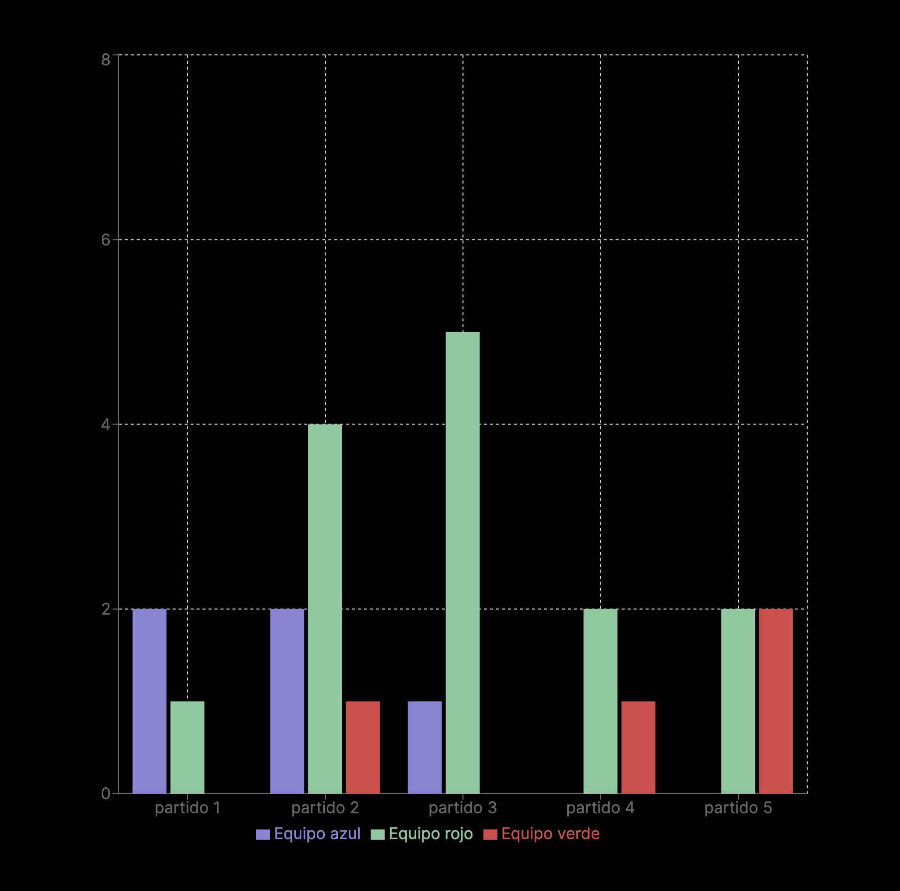

# Bienvenido al taller de barranquillaJS en la GDG Barranquilla

## Desarrollaremos una pagina web de analisis de temporadas de fultbol usando google sheets y firebase hosting

En este taller, exploraremos cómo crear una página web interactiva que permita analizar y visualizar datos de temporadas de equipos de fútbol.

Utilizaremos `Google Sheets` como base de datos para almacenar los datos de las temporadas, y `Firebase Hosting` como plataforma para desplegar nuestra página web.

## Veremos

- [Introducción al análisis de datos](/introduction/analitycs)
- [Como usar `Google Sheets` como base de datos](/google-intro/google-sheets)
- [Desarrollo de la página web de análisis de temporadas](/development/how-to-start)
- [Visualización de datos y análisis](/data-visualization/start-visual)
- [Despliegue de la página web en `Firebase Hosting`](/deployment/how-to-deploy)

## Lograras lo siguiente

- Conocimento sobre analisis de datos
- Como usar `Google Sheets` tanto como base de datos y como API
- Como usar `Firebase Hosting` como herramienta para subir apps webs
- Conocimiento de como trabajar con `NextJS` y server components

Aca dejo una version funcional del taller https://fife-fife-front.vercel.app
